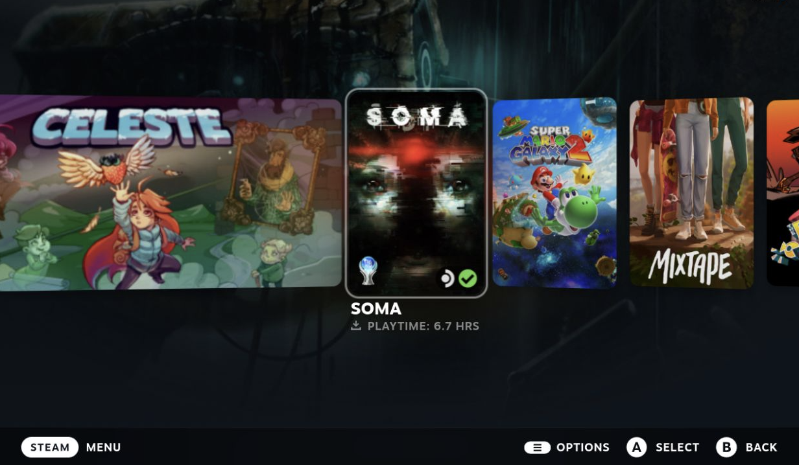

# Completionist

A [Decky Loader](https://github.com/SteamDeckHomebrew/decky-loader) plugin that displays a platinum trophy on the tiles of Steam games you've 100% completed.



## What it does

Scans your Steam library against Steam's own achievement data and renders a platinum trophy icon on the tile of any game where you have all achievements unlocked. Works on the home page Recent Games carousel and in the library grid. No Steam API key, no setup — the plugin reads from the same in-memory store that powers Steam's own achievement UI.

## Features

- **Automatic detection.** Scans on plugin load; trophies appear instantly on subsequent boots (cached to disk).
- **Live updates.** Subscribes to Steam's achievement-change events — the moment you unlock the final achievement for a game, its trophy appears on its tiles without you doing anything.
- **Configurable position.** Choose any of the four tile corners (top-right by default).
- **Three sizes.** Small / Medium / Large.
- **Tilts and scales with focus** so the trophy matches Steam's native tile animations.
- **Plays nice with SteamGridDB** custom art and CSS Loader themes.

## Installation

### Via the Decky store (recommended)

1. Open Decky on your Steam Deck.
2. Browse the plugin store.
3. Find **Completionist**, install.
4. Open the plugin; trophies appear on your platinum games within ~30 seconds.

### Manual install

1. Download the latest `Completionist.zip` from [Releases](https://github.com/jparisio/Completionist/releases).
2. In Decky's developer settings, install the plugin from the zip.

## Settings

Open Completionist in the Quick Access Menu. The **Display** section has two controls:

- **Position** — which corner the trophy sits in.
- **Size** — Small / Medium / Large.

Settings are saved to disk and persist across reboots.

## How it works

Steam's UI keeps an in-memory cache of your achievement progress at `window.appAchievementProgressCache`. For each game in your library, Completionist checks whether the game has achievements (`BGameHasAchievements`) and, if so, requests its cached progress (`RequestCacheUpdate`). A game where `all_unlocked` is `true` gets its `appid` added to the platinum set, which is then used to drive a CSS rule that injects a trophy `::after` pseudo-element on matching tiles.

Detailed write-up of the architecture is in the source — see [`src/index.tsx`](src/index.tsx).

## Compatibility & known limitations

- Tested on Steam Deck running SteamOS 3.x with Decky Loader v3.2.3+.
- Relies on Steam's internal JS API (`appAchievementProgressCache`, `SteamClient.Apps.*`). Major Steam Client updates can break the plugin — if trophies vanish after a Steam update, file an issue.
- "Platinum" is defined as all native Steam achievements unlocked. Games with no achievements are skipped.
- The plugin's initial scan can take ~30 seconds for very large libraries — subsequent loads use the cached set and apply trophies instantly.

## Development

Built from the official [decky-plugin-template](https://github.com/SteamDeckHomebrew/decky-plugin-template).

```bash
pnpm install
pnpm run build
./cli/decky plugin build .
```

Plugin source lives in [`src/index.tsx`](src/index.tsx); Python backend (for disk persistence) in [`main.py`](main.py).

## Credits

- Built on top of the [Decky Loader](https://github.com/SteamDeckHomebrew/decky-loader) project.
- Tile-patching approach informed by [decky-steamgriddb](https://github.com/SteamGridDB/decky-steamgriddb).
- Original plugin template © Steam Deck Homebrew, BSD-3-Clause licensed.

## License

BSD 3-Clause — see [LICENSE](LICENSE).
